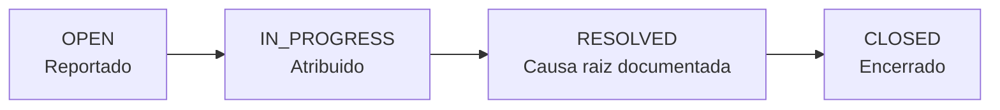
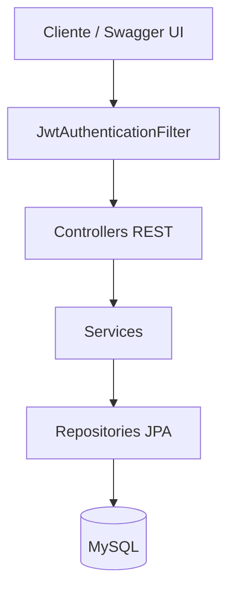

# Incident Tracker


API REST para gestao e investigacao de incidentes tecnicos, construida em
Java + Spring Boot. Projeto de portfolio focado em cobrir, na pratica, os
requisitos de uma vaga de estagio em backend: APIs REST, autenticacao/IAM,
CI/CD, containerizacao, boas praticas de versionamento e observabilidade
basica.

---

## Indice

- [Visao geral](#visao-geral)
- [Stack](#stack)
- [Arquitetura](#arquitetura)
- [Papeis e permissoes (RBAC)](#papeis-e-permissoes-rbac)
- [Como rodar](#como-rodar)
- [Variaveis de ambiente](#variaveis-de-ambiente)
- [Endpoints](#endpoints)
- [Testes](#testes)
- [CI/CD](#cicd)
- [Estrutura do projeto](#estrutura-do-projeto)
- [Decisoes de design](#decisoes-de-design)
- [Roadmap](#roadmap)

---

## Visao geral

Qualquer usuario autenticado (ADMIN ou ANALISTA) pode reportar um
incidente. Um analista assume, investiga, documenta a causa raiz ao
resolver, e o incidente e encerrado depois de validado. Cada mudanca de
status gera um registro de auditoria - e isso que permite reconstruir a
timeline completa de qualquer incidente depois, simulando uma investigacao
real.



---

## Stack

| Camada             | Tecnologia                                          |
| ------------------ | --------------------------------------------------- |
| Linguagem          | Java 21                                             |
| Framework          | Spring Boot 3.3.4                                   |
| Autenticacao       | Spring Security + JWT (JJWT 0.12.6)                 |
| RBAC               | `@PreAuthorize` com 3 papeis: ADMIN, ANALISTA, VIEWER |
| Persistencia       | Spring Data JPA / Hibernate                         |
| Banco de dados     | MySQL 8.4                                           |
| Migrations         | Flyway                                              |
| Validacao          | Bean Validation (Hibernate Validator)               |
| Documentacao API   | springdoc-openapi 2.6.0 (Swagger UI em `/docs`)     |
| Observabilidade    | Spring Boot Actuator (`/actuator/health`)           |
| Containerizacao    | Docker + Docker Compose                             |
| CI/CD              | GitHub Actions (build, lint, docker-build)          |
| Formatacao         | Spotless - Google Java Format                       |
| Testes             | JUnit 5 + Testcontainers (MySQL real)               |
| Build              | Maven 3.9                                           |

---

## Arquitetura

Camadas classicas, sem acoplamento entre elas - controller nunca fala
direto com repository:



Toda mudanca de status de incidente passa pelo `IncidentService`, que
alem de persistir o novo estado grava uma entrada em `IncidentHistory` -
a auditoria nao e um acrescimo por fora, e parte do fluxo principal.

---

## Papeis e permissoes (RBAC)

| Acao                        | ADMIN | ANALISTA | VIEWER |
| --------------------------- | :---: | :------: | :----: |
| Criar usuario               |  sim  |   nao    |  nao   |
| Listar usuarios             |  sim  |   nao    |  nao   |
| Ver o proprio perfil        |  sim  |   sim    |  sim   |
| Reportar incidente          |  sim  |   sim    |  nao   |
| Ver/listar incidentes       |  sim  |   sim    |  sim   |
| Mudar status do incidente   |  sim  |   sim    |  nao   |

---

## Como rodar

Pre-requisitos: Java 21, Maven, Docker Desktop.

### Opcao 1 - tudo via Docker Compose

```bash
docker compose up -d
```

Sobe o MySQL e a aplicacao juntos. A API fica em `http://localhost:8080`.

### Opcao 2 - banco no Docker, aplicacao local (recomendado em dev)

```bash
docker compose up -d mysql
mvn spring-boot:run
```

> O MySQL do Compose expoe a porta `3307` no host (nao `3306`) para nao
> conflitar com uma instalacao local de MySQL ja existente. Isso ja esta
> refletido no `application-dev.yml` - nao precisa configurar nada extra.

Na primeira subida, um usuario administrador e criado automaticamente
(veja [Variaveis de ambiente](#variaveis-de-ambiente)).

---

## Variaveis de ambiente

| Variavel          | Descricao                                    | Default (dev)                                     |
| ----------------- | -------------------------------------------- | ------------------------------------------------- |
| `DB_URL`          | URL JDBC do MySQL                            | `jdbc:mysql://localhost:3307/incident_tracker`     |
| `DB_USERNAME`     | Usuario do banco                             | `incident_tracker`                                |
| `DB_PASSWORD`     | Senha do banco                               | `incident_tracker`                                |
| `JWT_SECRET`      | Chave de assinatura dos tokens               | valor de desenvolvimento - **trocar em producao** |
| `ADMIN_EMAIL`     | Email do admin inicial (seed)                | `admin@incidenttracker.local`                     |
| `ADMIN_PASSWORD`  | Senha do admin inicial (seed)                | `changeme123` - **trocar em producao**            |

Em producao, essas variaveis devem vir de um cofre de segredos (Azure Key
Vault), nunca de um arquivo versionado.

---

## Endpoints

| Metodo  | Rota                      | Quem pode              | Descricao                                |
| ------- | ------------------------- | ---------------------- | ---------------------------------------- |
| `POST`  | `/auth/login`             | publico                | Login - retorna o JWT                    |
| `POST`  | `/users`                  | ADMIN                  | Cria um novo usuario                     |
| `GET`   | `/users`                  | ADMIN                  | Lista todos os usuarios                  |
| `GET`   | `/users/me`               | autenticado            | Retorna o perfil de quem esta logado     |
| `POST`  | `/incidents`              | ADMIN, ANALISTA        | Reporta um novo incidente                |
| `GET`   | `/incidents`              | autenticado            | Lista incidentes (filtros `status`, `priority`; paginado) |
| `GET`   | `/incidents/{id}`         | autenticado            | Detalhe de um incidente, com historico   |
| `PATCH` | `/incidents/{id}/status`  | ADMIN, ANALISTA        | Muda o status e registra no historico    |

Documentacao interativa completa (Swagger UI) disponivel em
`http://localhost:8080/docs` com a aplicacao rodando.

---

## Testes

```bash
mvn test
```

Os testes de integracao sobem um container MySQL real via Testcontainers
(precisa do Docker rodando) - nao usam banco em memoria, para evitar
divergencia de comportamento entre teste e producao.

| Teste                    | Tipo        | O que valida                                              |
| ------------------------ | ----------- | --------------------------------------------------------- |
| `JwtServiceTest`         | Unitario    | Geracao, validacao, expiracao e rejeicao de tokens        |
| `AuthControllerTest`     | Integracao  | Login com sucesso retorna token; senha errada retorna 401 |
| `IncidentControllerTest` | Integracao  | ADMIN cria incidente (201); VIEWER recebe 403; nao autenticado recebe 401 |

---

## CI/CD

Cada push ou PR contra a `main` roda tres jobs no GitHub Actions, em
paralelo:

- **`build`** - compila e roda os testes (incluindo os de integracao com
  Testcontainers)
- **`lint`** - verifica formatacao com Spotless (Google Java Format)
- **`docker-build`** - builda a imagem Docker, validando o `Dockerfile`

A branch `main` e protegida: nada e mergeado sem passar por Pull Request
e sem os tres checks verdes.

---

## Estrutura do projeto

```
src/main/java/com/seunome/incidenttracker/
├── config/          SecurityConfig, AdminSeeder
├── controller/      Auth, User, Incident
├── dto/             Records de entrada/saida da API
├── entity/          User, Team, Incident, IncidentHistory + enums
├── exception/       GlobalExceptionHandler
├── mapper/          (MapStruct - vazio, planejado para refactoracao)
├── repository/      Spring Data JPA
├── security/        JwtService, JwtAuthenticationFilter, UserDetailsService
└── service/         Regras de negocio (Auth, User, Incident)
```

---

## Decisoes de design

**Por que Testcontainers e nao H2?**
O H2 emula MySQL mas nao e 100% compativel (tipos, funcoes, collations).
Testcontainers sobe um MySQL 8.4 real - o que o teste valida e exatamente
o que roda em producao. A dependencia do H2 esta no `pom.xml` (scope
`test`) mas nao e usada, mantida como referencia futura.

**Por que JWT stateless?**
Simula o padrao real de APIs que servem multiplos clientes (web, mobile).
O token expira em 60 minutos; refresh tokens estao no roadmap.

**Por que Flyway e nao `ddl-auto`?**
Migrations versionadas dao rastreabilidade do schema, permitem revisao
em PR e evitam perca de dados em producao. O `ddl-auto` esta em
`validate` - o Hibernate valida o schema contra as migrations, mas nunca
o altera.

**Por que `GlobalExceptionHandler` centralizado?**
Todos os erros retornam JSON consistente com `timestamp`, `status` e
`message`. Erros de validacao incluem um mapa `fields` com os erros
especificos. Isso evita respostas de erro inconsistentes entre endpoints.

---

## Roadmap

- [ ] CRUD de `Team` (a entidade e o repositorio existem, mas nao ha
  controller/service/DTOs)
- [ ] Refresh tokens (a config `jwt.refresh-expiration-days` existe no
  YAML mas nao e consumida pelo codigo ainda)
- [ ] Deploy na Azure (App Service ou Container Apps) com Key Vault
  para os segredos
- [ ] ADRs documentando as decisoes de arquitetura
